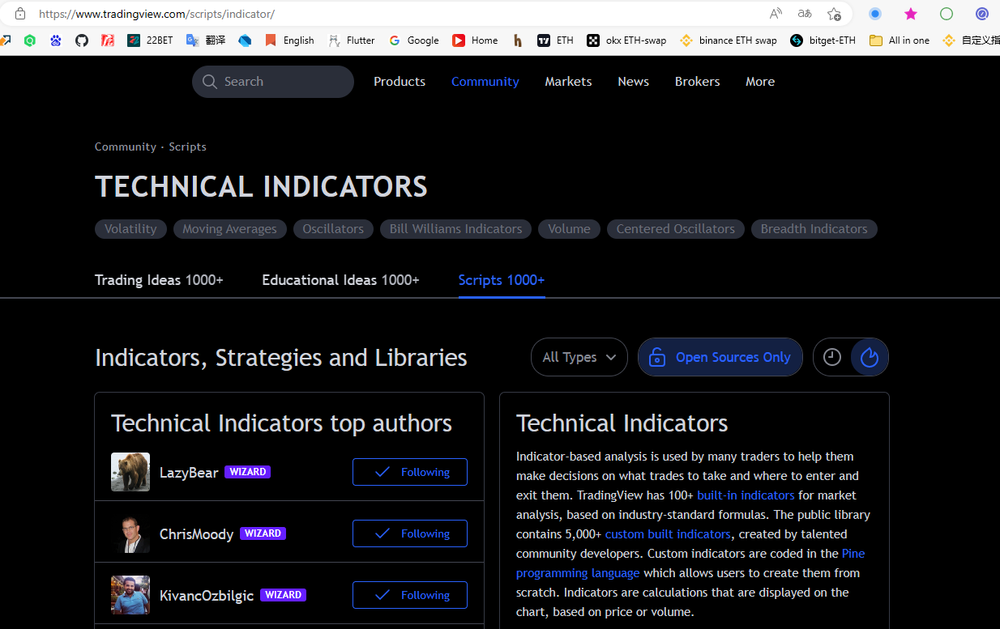

## TradingView图标颜色


<font color="#ff5252">动量柱上升 Red #ff5252 </font>

<font color="#ffcdd2">动量柱下跌 Red #ffcdd2 </font>

<font color="#fe0116">亮红 Red #fe0116 </font>

<font color="#df473d">亮红1 Red #df473d </font>

<font color='#26a69a'>动量柱上升 Green #26a69a </font>

<font color='#b2dfdb'>动量柱下跌 Green #b2dfdb </font>

<font color='#06ff10'>亮绿 Green #06ff10 </font>

<font color='#05c48e'> 亮绿1 Green #05c48e </font>


## TradingView 获取高热度指标



> 打开控制台，输入下方脚本，滚动页面往下即可

```js
// treading view 高热度指标筛选脚本
let contentHeight = 0
const content = document.getElementById('tv-content')
document.addEventListener('scroll', () => {
    if (content.clientHeight !== contentHeight) {
        findTop5Hot()
        contentHeight = content.clientHeight
    }
})

let set = new Set()
const findTop5Hot = () => {
    const count = document.getElementsByClassName('tv-card-social-item__count');
    const elWithCount = [...count].map(el => {
        const num = el.textContent
        return {el, num: Number(num)}
    });
    const sorted = elWithCount.sort((a, b) => b.num - a.num)
    for (const el of set) {
        el.parentElement.removeChild(el)
        console.log(el)
    }
    set = new Set()
    for (let i = 0; i < 5; i++) {
        const item = sorted[i]

        if (item) {
            item.el.style = 'background-color:red;color:white;font-size:16px;font-weight:bold;'
            insertButton(item.el, item.num, i)
        }
    }
}

const insertButton = (el, num, i) => {
    const btn = document.createElement('button')
    btn.addEventListener('click', () => {
        el && el.scrollIntoView({block: "center", inline: "center"})
    })
    btn.textContent = `指标热度：${num}`
    btn.style = `
    position: fixed;
    top: ${i * 32}px;
    right: 0px;
    z-index: 200000;
    color: #000;
    font-weight: bold;
    font-size: 18px;
    `
    set.add(btn)
    document.body.append(btn)
}

(() => {
    insertButton()
})()
```


