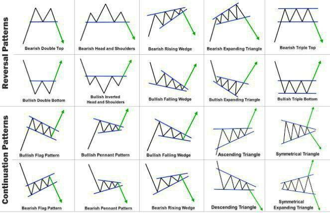

## Engulfing

吞没形态主要蕴含的是交易当中市场资金和心里博弈过程。因此是直观表现了整个市场当时的运行状态。

集合以上图例，在运用吞没形态的时候，需要注意几个要点：

第一，前后两个[K线](https://baike.baidu.com/item/K线/590751?fromModule=lemma_inlink)的颜色必须是相反的，也就是说两根K线当中必须要有阴阳两根线。

第二，后一根K线的实体柱务必要包含前一根K线的实体柱，也就是说后一根K线的开盘或者收盘价都要比前 [1] 价格要高或者低。

第三，并不是所有出现的吞没形态都能有效，在行情运行到关键区间位置的时候比如出现在行情长期下跌或者长期上涨过后，吞没形态的效果会更明显。

实际交易当中与吞没形态配合的比较好的指标：

[趋势线](https://baike.baidu.com/item/趋势线?fromModule=lemma_inlink)：当行情运行到趋势线附近是，出现看涨或者[看跌吞没](https://baike.baidu.com/item/看跌吞没/1392862?fromModule=lemma_inlink)形态行情反弹或者反转的可能性比较大

[均线](https://baike.baidu.com/item/均线?fromModule=lemma_inlink)：吞没形态出现后，[均线系统](https://baike.baidu.com/item/均线系统/3042171?fromModule=lemma_inlink)配合出现[金叉](https://baike.baidu.com/item/金叉/10998892?fromModule=lemma_inlink)或者[死叉](https://baike.baidu.com/item/死叉/9754010?fromModule=lemma_inlink)，效果也能够得到更好的确认。

水平阻力位支撑位：行情运行的前期高点或者低点附近，出现吞没形态，则表明上方压力比较大，行情可能会出现承压下跌或者上涨。

[MACD](https://baike.baidu.com/item/MACD/3334786?fromModule=lemma_inlink)：当[K线](https://baike.baidu.com/item/K线/590751?fromModule=lemma_inlink)收吞没形态，而恰好配合MACD出现中指形态或者配合快慢线出现死叉、金叉，则可以更加确定行情接下来会出现反转的可能性

## Hammer

Hammer candlesticks form when a security moves lower
after the open, but continues to rally into close abovethe intraday low. The candlestick that you are left withwill look like a square attached to a longstick-likefigure. This candlestick is called a Hammer if it happens
to form during a decline

锤子
当证券价格走低时形成锤形烛台
开盘后，但继续反弹，收于盘中低点上方。 你留下的烛台看起来像一个正方形，附在一个长棒状的图形上。 如果发生这种情况，则此烛台称为锤子
在下跌期间形成

## Doji

When the open and close of a security are essentially
equal to each other, a doji candle forms. The length of both upper and lower shadows may vary, causing the candlestick you are left with to either resemble a cross,
an inverted cross, or a plus sign. Doji candles show the
All playout of buyer-seller indecision in a tug-of-war of
sorts. As price moves either above or below the opening level during the session, the close is either at or near the opening level.

十字星
当证券的开盘和收盘本质上是
彼此相等，形成十字星蜡烛。 上影线和下影线的长度可能会有所不同，从而导致您留下的烛台类似于十字架，
倒十字或加号。 十字星蜡烛显示买卖双方优柔寡断的拉锯战， 当价格在交易时段内高于或低于开盘价时，收盘价处于或接近开盘价。
