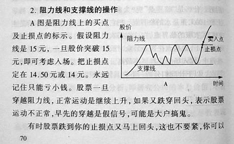
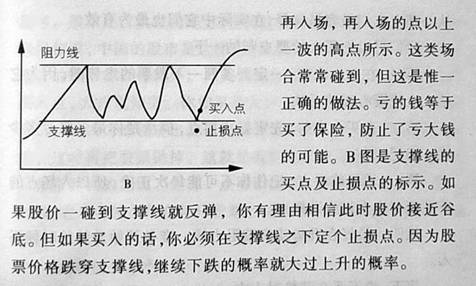
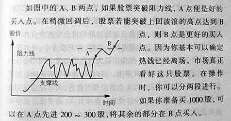
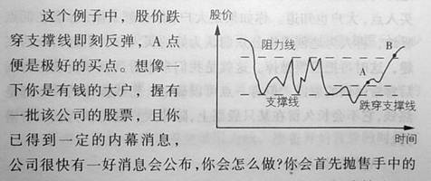
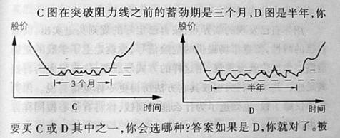

## 何时买入股票

### 接受损失

任何交易都会有损失，在买入之前你必须思考究竟能承受多大的损失，但是无论如何止损都不能超过**20%**。

<u>止损的作用是为了避免更大的损失的产生。</u>

### 找零界点

#### 1. 升势操作

当股票涨至上图入场点可买入股票，该入场点可视为新波动的开始，止损点应设在入场点以下，可以是B点价位，但是如果跌破B点必须离场。`B <= LeaveSpot < A`

#### 2. 阻力线和支撑线的操作

当股票涨至阻力线如果形成突破可买入股票，也可在阻力线买入，止损点可设置低于买入点1-1个点，也可设置为低于阻力线1-2个点。

有时股票跌到你的止损点又马上回头，这也不要紧，你可以再入场，再入场的点以上一波的高点所示。这类场合常常碰到，但这是惟一正确的做法。亏的钱等于买了保险，防止了亏大钱的可能。

`LeaveSpot < Buy || LeaveSpot < ResistanceLine`

B 图是支撑线的买点及止损点的标示。如果股价一碰到支撑线就反弹，你有理由相信此时股价接近谷底。但如果买入的话，你必须在支撑线之下定个止损点。因为股票价格跌穿支撑线，继续下跌的概率就大过上升的概率。

`LeaveSpot < SupportLine && LeaveSpot < Buy && SupportLine < Buy`

#### 3. 双肩图和头肩图的操作

倒头肩图是一个基本的买入信号，下跌趋势逆转通常发生在这里，突破波峰线通常为买入点。

<u>头肩底中的头和肩如果平行的话就变成三肩图。把升势时的波峰连接，再把波谷连接，你就看到隧道。</u>

**第一，在买入之前，一定要参照一下股票的走势图，因为它是大众投资心理的反映。**

**第二，在买入之前，先定好止损点，搞清楚你最多愿亏多少钱。切记照办。**

**第三，选择临界点，记住你不可能每次正确，所以入场点的获胜概率应大过失败概率。**

**第四，最好在升势或突破阻力线，准备开始升势的时候买入。**

**第五，绝不要在跌势时入市。**

**第六，不要把“股票已跌了很低了”作为买入的理由，你不知道它还会跌多少！**

**第七，不要把“好消息”或“专家推荐”作为买的理由，特别在这些好消息公布之前，股票已升了一大截的情况下。**

**第八，记住这些要点及点点照办。**

#### 关键：把握临界点

如图中的 A 、 B 两点，如果股票突破阻力线， A 点便是好的买入点。在稍微回调后，股票若能突破上回波浪的高点达到 B 点，则 B 点是更好的买入点。因为你基本可以确定热钱已经离场，市场真正看好这只股票。在操作时，你可以分两段进行。如果你准备买 1000 股，可以在 A 点先进 200-300 股，将其余的部分在 B 点买入。

**这里要再次强调交易量的重要性。如果交易量没有增加，突破阻力线的现象并没有很大意义。**

这个例子中，股价跌穿支撑线即刻反弹， A 点便是极好的买点。想像一下你是有钱的大户，握有一批该公司的股票，且你已得到一定的内幕消息，公司很快有一好消息会公布，你会怎么做？你会首先抛售手中的股票，让股价跌破支撑线，因为你知道股价一旦跌破支撑线，会引发市场恐慌性抛售，这时你开始大量吸纳。**以我自己的经验，如果股价跌穿支撑线，交易量大增且股价很快弹回支撑线之上，这是极佳的买入机会。**

**你要记着：你买的股票都是别人卖给你的，你卖的股票都被别人买去了。**

### 选股

A 、 B 图分别代表两只股票的走势图，这两只股票都属于“牛劲”足的类别股中，你现在选一只股票，你会选哪只？假设阻力线的价格同是 20 元。

很多人靠直觉会选 B ，因为它从高价跌下来，是“偏宜货”。答案是：错了，你应该选择 A 图的股票。为什么呢？先看 B 图。很多原先在 20 元的阻力线之上入市的股民已被套牢很久，他们终于等到了不亏或稍赚解套的机会，你认为他们现在会怎样做？他们会赶快跑，快快让噩梦结束。一般人就是这么想的，也是这样做的。

再看 A 图。每位在阻力线之下入市的股民都已有了利润，他们已不存在套牢的问题。你会发现 A 图股票上升的阻力会较 B 图来得小。

C 图在突破阻力线之前的蓄劲期是三个月， D 图是半年，你要买 C 或 D 其中之一，你会选哪种？答案如果是 D ，你就对了。被套牢是极其不愉快的经历，晚上睡觉时想到这只股票都睡不好！很多人撑不住就割肉算了。蓄劲期越久，那些被套牢还未割肉的投资者就越少，它上升时的阻力也就越小。

### 形成自己的风格

用你自己发现的临界点，按自己定好的规则买进卖出，训练自己的耐性，留意市场提供的危险信号，你就走上了学股的正确道路。你很快就会发现，用这样的方式炒股票，你有极 \ 大的自我满足感，其所得利润也较其它方法所得更令你觉得喜悦。因为你不仅赚了钱，也知道了为什么能赚到钱，你将有信心按同样方法再次赚到钱。

最后谈点我个人的经验。股票和人一样，有其特别的个性，有些保守、迟缓，有些急躁、不安分。对某些股票来说，我能很容易揣摸出其个性，推断出其运动轨迹。而有些和我无缘，其运动模式我怎么都猜不透。对这些无缘的股票，每次碰到我都被烫伤。就如同交朋友，有些第一次见面就相见恨晚，无话不谈，有些话不投机半句多。我采用的具体做法是，如果某只股票烫我三次，我就尽量不再碰它。把注意力放在合心意的股票上。<u>选择合适的股票</u>

## 何时卖股票

### 截短亏损，让利润奔跑

**华尔街将炒股的诀窍归纳成两句话：截短亏损，让利润奔跑！英文叫** Cut loss short, let profit run ! **意思即是一见股票情况不对，即刻止损，把它缩的越短越好！一旦有了利润，就必须让利润奔跑，从小利润跑成大利润。**

## 华尔街的家训

几百年来，炒股行的先辈们用他们的经验写下一条条的家训 -- 想在这行生存和成功所必须遵循的原则。这些原则一百年前适用，今天适用，一百年后一样适用，因为人性不会改变。

时刻牢记：**市场从来不会错，而你的想法常常是错的。**

“我很早就发现华尔街没有什么新东西，也不可能有什么新东西，因为股票投机历史悠久，**今天在股市发生的一切都在以前发生过，也将在未来不断地再发生。**我进场之前就知道我判断正确的时候，我总是会赚到钱。使我犯错的是我没有足够的毅力按计划做，即只有在先满足我入场条件时才入场……”

**１，止损，止损，止损！**

这是炒股行的最高行为准则。

**２，分散风险**

手头的资本分成五至十份，在你认为至少有 1 ： 3 的风险报酬比率时把其中的一份入市，同时牢记止损的最高生存原则，长期下来，不赚钱都难。

**３，避免买太多股票**

手头股票太多时，产生的结果就是注意力分散，失去对单独股票的感觉

**４，有疑问的时候，离场**

很多时候，你根本就对股票的走势失去感觉，你不知它要往上爬还是朝下跌，你也搞不清它处在升势还是跌势。此时，你的最佳选择就是离场！离场不是说不炒股了，而是别碰这只股票。

**５，忘掉你的入场价**

坦白地讲，没有三五年的功力，交过厚厚的一大叠学费，要你忘掉进价是做不到的，但你必须明白为什么要这么做。今天你手中拥有的股票，按你的经验，明天都应该会升。如果经验告诉你这只股票的运动不对了，明天可能会跌，那你把它留在手中干什么？这和你在什么价位进价有什么关系？之所以难以忘掉进价，这和人性中喜赚小偏宜，决不愿吃小亏的天性有关。如果这只股票的价位已较你的进价为高，你脱手会很容易，因为你已赚了便宜。若低的话，你须面对“吃亏”的选择！普通人会找一百个“理由”再懒一会儿。朋友，“再懒一会”的价钱很高的。人很难改变自己的人性，那就试着忘掉进价吧！这样你就能专注于正确的时间做正确的事。

**６，别频繁交易**

经验累积到一定地步，你就会明白股市不是每天都有盈利机会的。你觉得不买不卖就没事干，缺少刺激，代价是每次出入场的手续费。除了手续费之外，每天买卖都带给你情绪的波动，冲散了冷静观察股市的注意力。可以这么说，在你留意跟踪的股票中，每天都有 70% 胜算的交易机会是骗人的。频繁交易常常是因为枯燥无聊。频繁交易不仅损失手续费，同时使交易的质量降低。

**７，不要向下摊平**

犯了错，不是老老实实地认错，重新开始，抱着侥幸心理，向下摊平，把平均进价降低，希望股票小有反弹就能挽回损失，甚至赚钱。这是常人的想法和做法，在这行则是破产的捷径。

对炒股老手来讲，可以有很多例外。其中之一就是股票在升势时，任何点都是好的入场点，碰巧你一入场，股票开始正常下调，在下调结束回头的时候，你可以考虑再进点股，就算进价较你第一次进价为低也没有关系。这样做的思想基础不是为了解套，而是你“知道”股票的升势还在继续。只有将炒股武艺炼到“无招”地步的炒手才可以考虑这么做，没有三五年的经验莫谈。新手们谨请记住：**不要向下摊平**！

**８，别让利润变成亏损**

在任何情况下，尽量保住你的本金。

**９，跟着股市走，别跟朋友走！**

一位真正懂炒股的人通常不愿别人跟着买，因为你可以跟我买，但我要卖的时候你不知道，结果可能害了你。如果卖股票时还要记着通知你，心理负担多大。亏的话怎么办？

朋友，下点功夫，研究股票的过动规律，学着选择买点和卖点。想跟朋友买卖不要紧，掂掂他是什么材料。喜欢你跟着的通常本身是瞎子，瞎子喜欢带路。

**１０，该卖股票的时候，要当机立断，千万别迟疑！**

股票波动从来花样百出，它在跌的时候，总会不时给你个小反弹，给你一线希望，让你觉得跌势已开始转头。股票重新下跌，你原来的希望破灭，准备割肉放弃时，它又来个小反弹，重新把你拴住。开始小小的损失，经过几个这样的来回，变成了大损失。这就是已学会“止损”的股友还会亏大钱的原因。

定好了出场价，当股票跌到这点时，不要幻想，不要期待，不要讲理由，即刻卖掉再说。

**１１，别将“股价很低了”当成买的理由，也别将“股价很高了”当成卖的理由！**

别试着去接往下掉的刀子，它会把你的手扎得血淋淋的！所谓炒手，最重要的是跟势，股票从 40 美元跌到 20 美元，明显是跌势，你不能逆势而行。

别将“股价很高了”当成卖的理由，你永远不知股票会升多高。只要股票的升势正常，别离开这只股票。记住前面提到过的华尔街格言：**截短亏损，让利润奔跑！**

**１２，定好计划，按既定方针办**

越聪明的人，越容易自以为是。他们在生活中的决定通常正确的居多，有些是开始不对劲，但最终证明他们正确。但在股票行，或许最终他们确实是正确的，但在市场证明之前，他们可以早已剃光头回家了。**不要自以为是，不要有虚荣心，按市场给你的信息来决定行动计划，一有不对即刻认错，这才是股市的长存之道**。