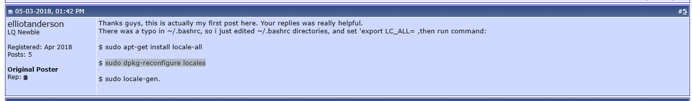

[每日新鲜事](/2022/10/14/每日新鲜事/)


## 色花堂账号密码

<!-- 色花堂账号密码 -->

  <div class="flex items-center py-1">
    <input class="text-sm font-serif font-bold text-gray-800 h-6 w-auto px-2 
      border border-solid border-gray-500 rounded 
        active:outline-sky-300 active:outline-1 
        focus:outline-sky-400 focus:outline-2" id="sht_account" type="text" value="llorz_o" readonly>
    <button class="text-sm h-6 px-2 ml-2 text-white bg-blue-500 rounded hover:bg-blue-600" type="button"
      onclick="document.getElementById('sht_account').select();document.execCommand('Copy');">
      复制
    </button>
  </div>
  <div class="flex items-center py-1">
    <input class="text-sm font-serif font-bold text-gray-800 h-6 w-auto px-2 
      border border-solid border-gray-500 rounded 
        active:outline-sky-300 active:outline-1 
        focus:outline-sky-400 focus:outline-2" id="sht_password" type="text" value="zlc@ID725361" readonly>
    <button class="text-sm h-6 px-2 ml-2 text-white bg-blue-500 rounded hover:bg-blue-600" type="button"
      onclick="document.getElementById('sht_password').select();document.execCommand('Copy');">
      复制
    </button>
  </div>

## Sansung wallet password

<div class="flex items-center py-1">
    <input class="text-sm font-serif font-bold text-gray-800 h-6 w-auto px-2 
                  border border-solid border-gray-500 rounded 
                  active:outline-sky-300 active:outline-1 
                  focus:outline-sky-400 focus:outline-2" id="samsungpassword" type="text" value="]gAJp)3W)k" readonly>
    <button class="text-sm h-6 px-2 ml-2 text-white bg-blue-500 rounded hover:bg-blue-600" type="button"
            onclick="document.getElementById('samsungpassword').select();document.execCommand('Copy');">
        复制
    </button>
</div>


## Windows software

| 名字           | 类型                 | 简介                                                         | 链接 |
| -------------- | -------------------- | ------------------------------------------------------------ | ---- |
| Clover         | 文件资源管理【free】 | **Clover**这个小工具，能让**本地资源管理器实现“标签化”的效果**，就像谷歌 Chrome 浏览器那样方便好用。在查看和操作多个不同路径的文件夹时尤为方便，极大提高电脑操作的效率！ |      |
| Everything     | 文件搜索【free】     | Everything是一款**完全免费的本地文件搜索工具，占用内存小、搜索速度快**，是一个非常实用的工具。 |      |
| Ditto          | 剪切板管理           |                                                              |      |
| Folder Painter | 文件资源管理【free】 | 通过Folder Painter这个**完全免费又非常实用的小工具**，在Windows上也可以实现更改文件夹颜色和样式，可以更加方便查找和管理文件。 |      |
| DeskGo         | 桌面整理【free】     | 企鹅大厂出品的**完全免费的桌面整理软件，非常简洁易用、没有广告**。 |      |
| Quicker        | 鼠标增强【free】     | 可以通过自定义添加到软件面板从而实现快速启动软件、文件、网址等，打造属于自己的常用工具库。 |      |
| Listary        | 全文搜索【free】     | Listary除了能够搜索**关键词、文件、应用之外，还可以直接搜索网页**。 |      |
| Bandicam       | 录屏【free】         | 占用内存较小，非常适合进行日常的屏幕录制，**还支持微课、游戏等较长时间的视频录制**。 |      |
| Snipaste       | 截图【free】         | sinpaste一个简单但强大的截图工具，也可以让你将截图贴回到屏幕上，**截图质量高、画质清晰**。 |      |
| PDF Candy      | PDF                  | 全部PDF功能                                                  |      |
| Pot Player     | 视频播放             |                                                              |      |
| Geek Uninstall | 卸载                 | 极客卸载，**和流氓软件拜拜的彻底卸载工具**                   |      |
| Photo Zoom     | 图片                 | 无损放大                                                     |      |
| Cloud Box      | 工具合辑             | Cloud Box是一款拥有超多功能的免费工具箱，为用户的电脑重装、管理提供了便利，满足娱乐、办公、及喜欢搞机的用户需求 |      |
| Eagle Get      | 下载                 | 猎鹰，是一款国外免费下载神器，与迅雷不同，**EagleGet**更加简洁、清爽的界面，体积小。支持HTTP、HTTPS、FTP、MMS、RTSP，BT |      |
| 优效日历       | 日历                 | 增强windows日历                                              |      |
| Drop It        | 文件资源管理         | 全自动文件管理                                               |      |
| ScreenToGif    | 录屏 gif             | 保存录屏为 Gif，不用再为短时间的操作录屏而烦恼啦，默认临时文件保存五天 |      |
| PicGo          | 图床                 | 强大的图床管理工具                                           |      |
| 硕鼠           | 视频 下载            | https://www.flvcd.com/                                       |      |
| files          | 文件资源管理         | [files-community/Files：为 Windows 构建最佳文件管理器体验 (github.com)](https://github.com/files-community/Files) |      |

## 网穿透客户端配置

```ini
[common]
bind_port=7000
token=725361
vhost_http_port=8080
vhost_https_port=8443
dashboard_port=7500
dashboard_user=richard
dashboard_pwd=725361
```

## 打开终端就能使用默认的nvm node

使用`nvm install 16.15.1`创建`~/.nvmrc`

```
16.15.1
```

## 在`windows`中运行`sh`脚本

```bash
start "" "%PROGRAMFILES%\Git\bin\sh.exe" -c "sh autoBuild.sh"
```

## Linux 系统语言设置

[Debian & Ubuntu & CentOS 更改系统语言方法 – 主机指南 (hostarr.com)](https://www.hostarr.com/change-language-in-linux/)



## Hestia CP

`nginx` 配置文件模板`/usr/local/hestia/data/templates/web/nginx/`

`nginx` 创建域后的配置文件路径：`/etc/nginx/conf.d/domains`

## Linux FTP 上传解压BUG

> 从`Windows`上传`zip`文件到`Linux`时需要修改传输模式为`binary`,具体切换如下
>
> ```bash
> ftp> bin
> 200 TYPE is now 8-bit binary # 出现下面这行就是 binary 传输模式
> ```
>
> 如果不进行切换的话将无法成功`unzip`传输的文件

## 脚本使用

```bash
hexo new post title # 创建一篇文章
hexo new page page_title # 创建一个页面
```

> 创建页面需要修改`themes\pure\_config.yml`中的`menu,menu_icons`字段
>
> 添加语言文件`themes\pure\languages\zh-CN.yml`中的`menu`的翻译
>
> icon 图标见 [Icon Font (cofess.com)](http://blog.cofess.com/hexo-theme-pure/iconfont/demo_fontclass.html)
